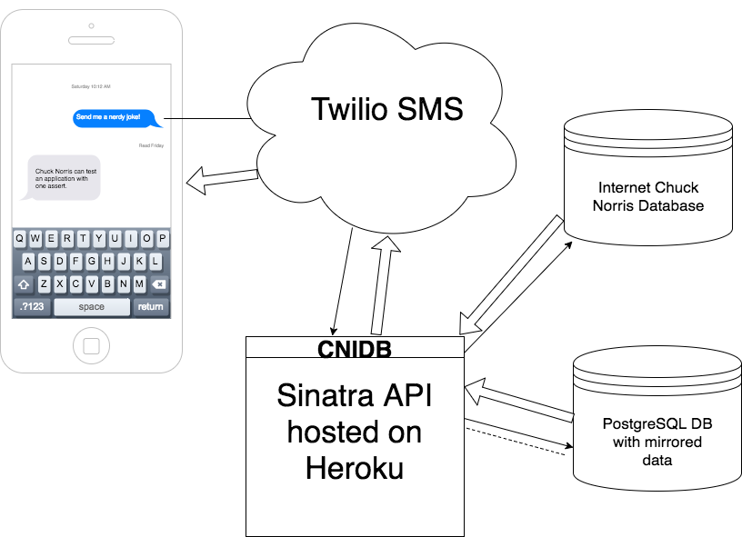
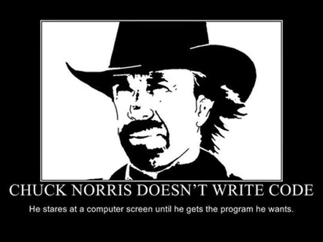

# ChuckNorrisIDB
An SMS service that sends Chuck Norris jokes to your phone via the Chuck Norris Internet Database API and Twilio.

# How To Use
Send a text message to 1-415-275-2620.  Receive joke.

You can also send the word 'nerdy' to get a nerdy joke, or the word 'dirty' for a dirty joke.  Just remember, thousands of people die every year from Chuck Norris joke related incidents.

# How It Works
An SMS message is sent to the phone number above.  Twilio sends a webhook request to this API written in Ruby on Sinatra, which reaches out to the Internet Chuck Norris Database, retrieves a JSON payload, and sends it back to Twilio, to be delivered to your SMS enabled device.

